#IO-bound
##Выполнение синхронно в один поток:
###Диспетчер задач:

###Время выполнения:
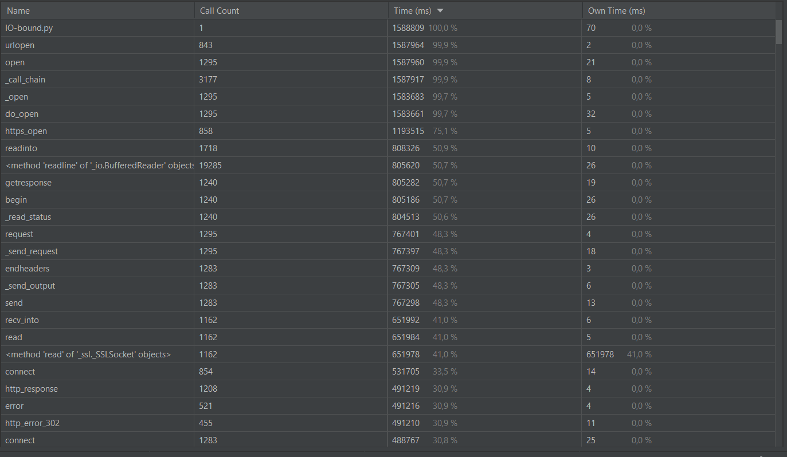
##Выполнение используя ThreadPoolExecutor:
##max_workers = 5
###Диспетчер задач:
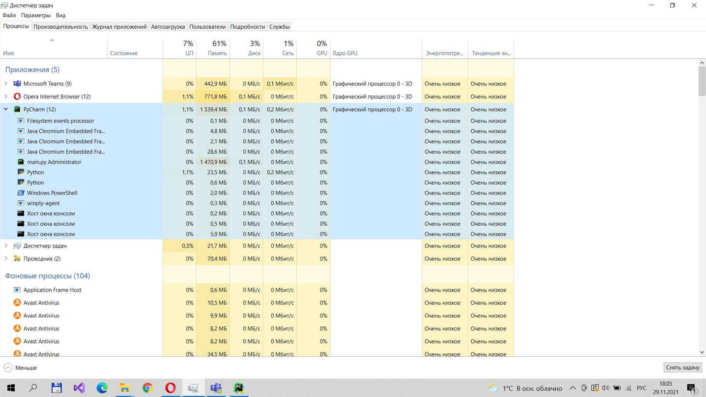
###Время выполнения:
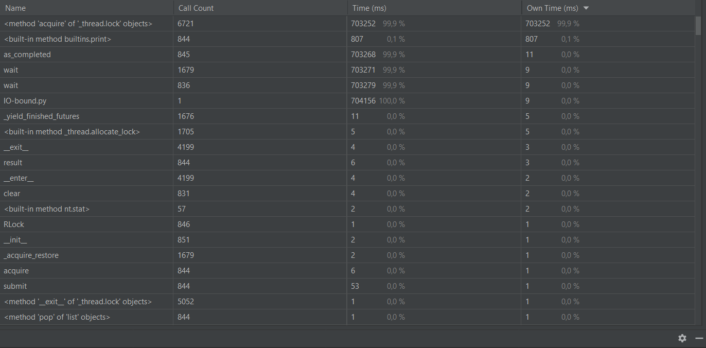
##max_workers = 10
###Диспетчер задач:
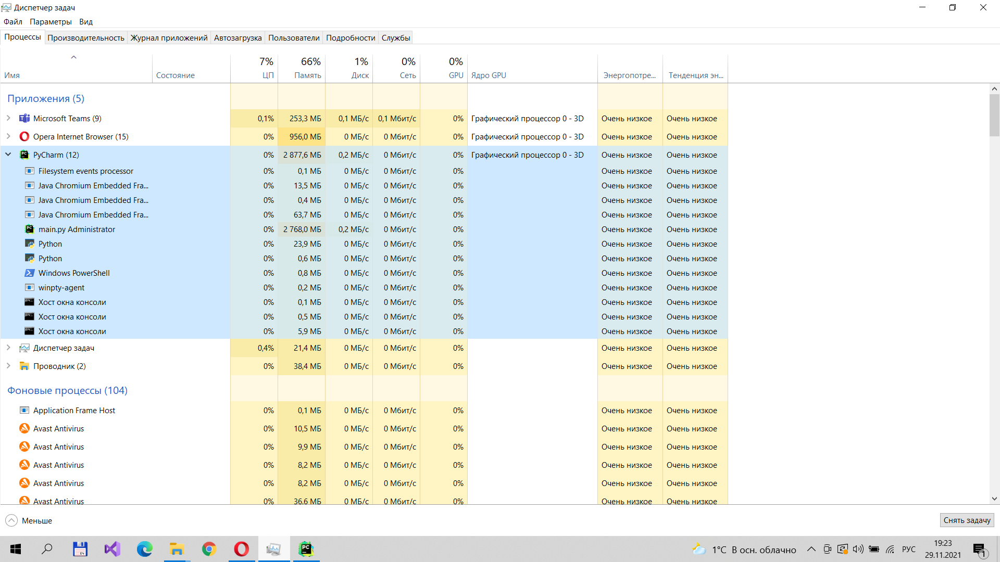
###Время выполнения:
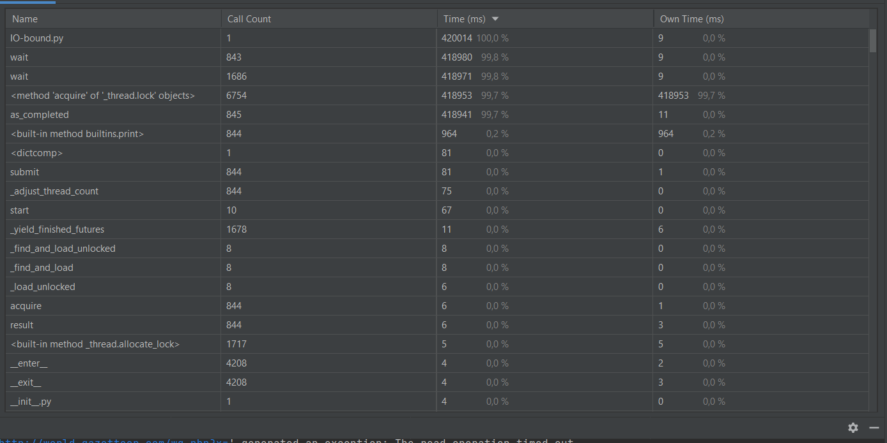
##max_workers = 100
###Диспетчер задач:
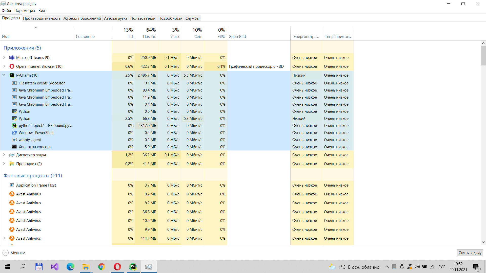
###Время выполнения:
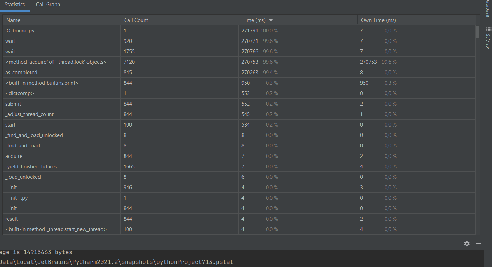
####При преобразованиях можно заметить, что время выполнения значительно уменьшается, но загрузка памяти отличается всего лишь на пару процентов, процессор в основном одинаков, но бывают скачки и получается заметное отличие.
#CPU-bound
##Выполнение на одном ядре:
###Диспетчер задач:
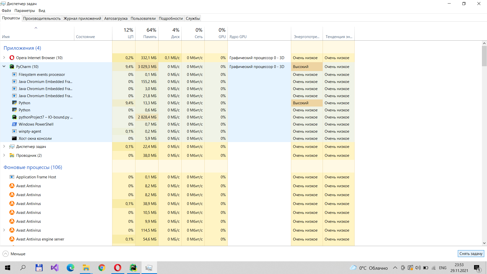
###Время выполнения:
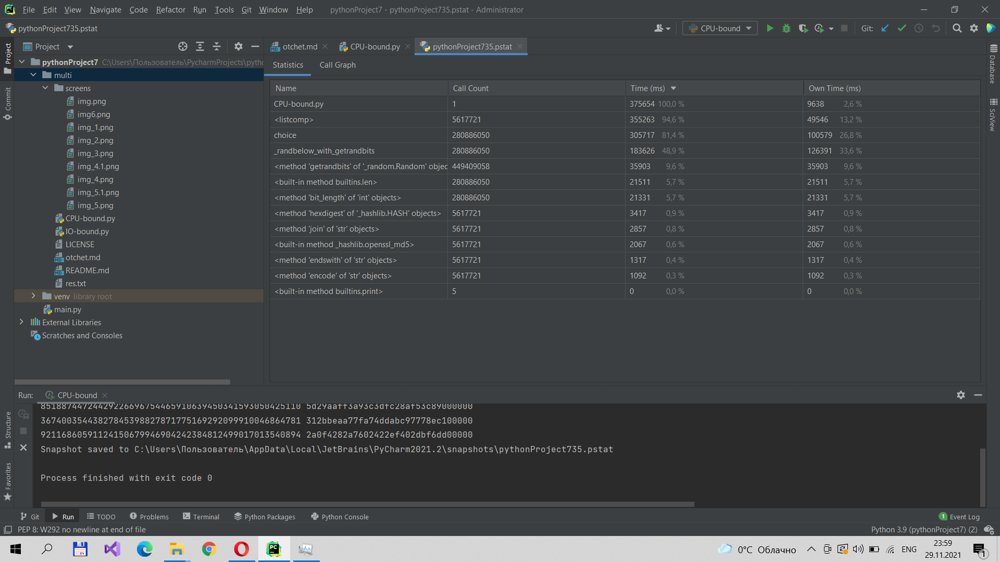
##max_workers=2
###Диспетчер задач:
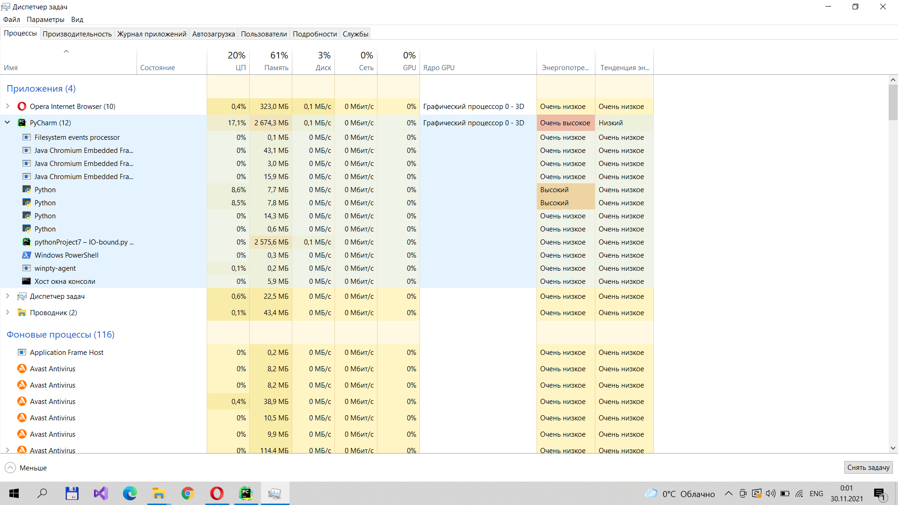
###Время выполнения:
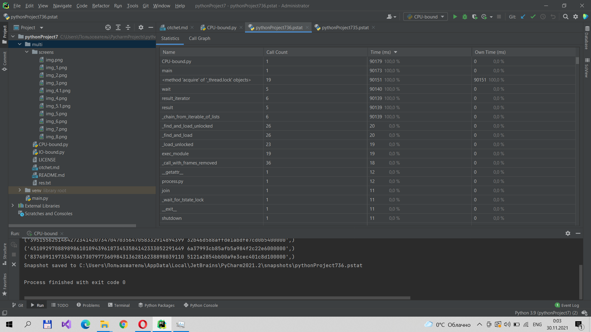
##max_workers=4
###Диспетчер задач:
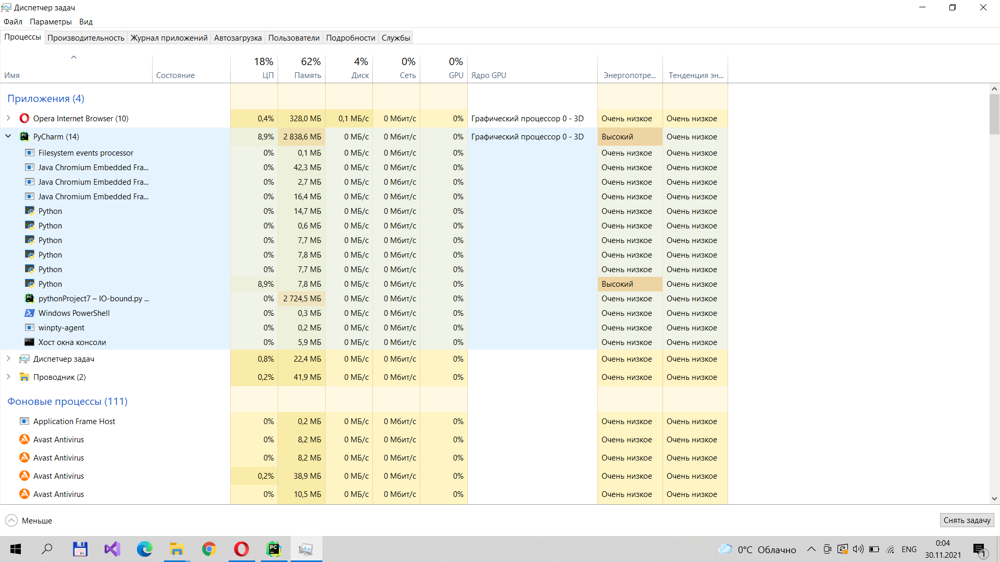
###Время выполнения:
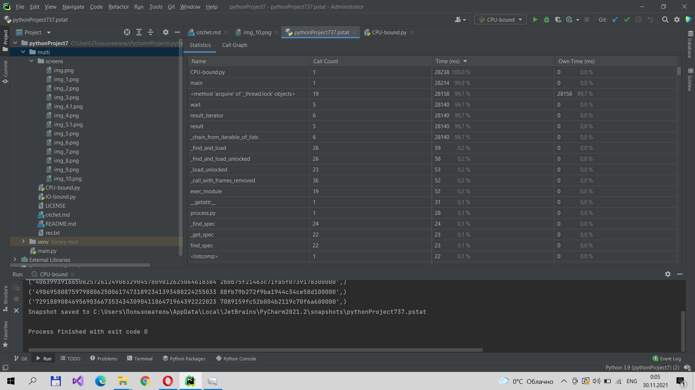
##max_workers=5
###Диспетчер задач:
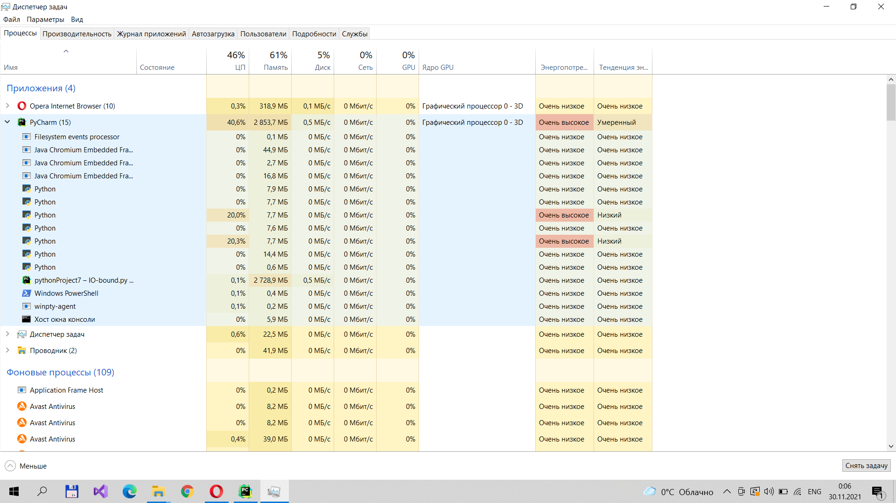
###Время выполнения:
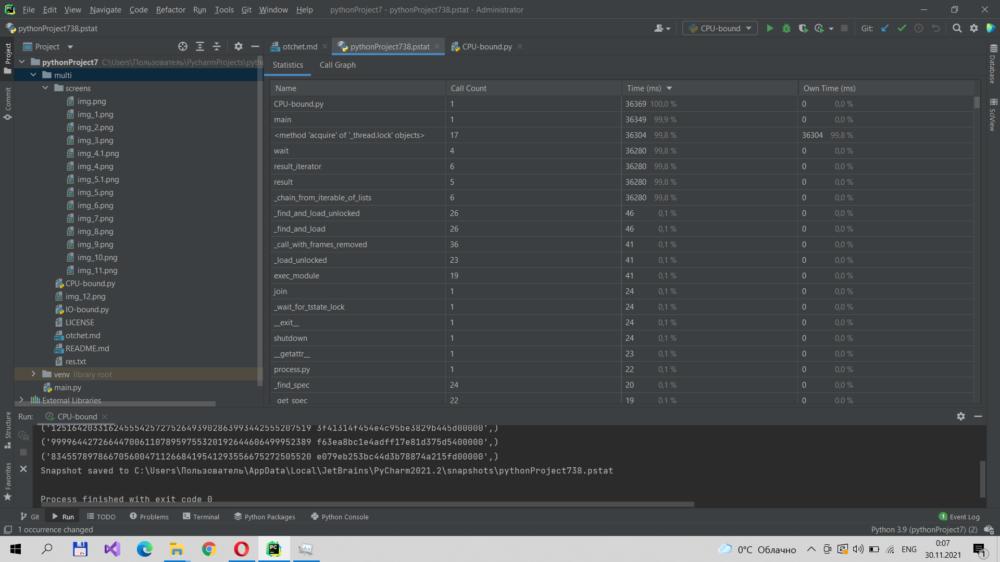
##max_workers=10
###Диспетчер задач:
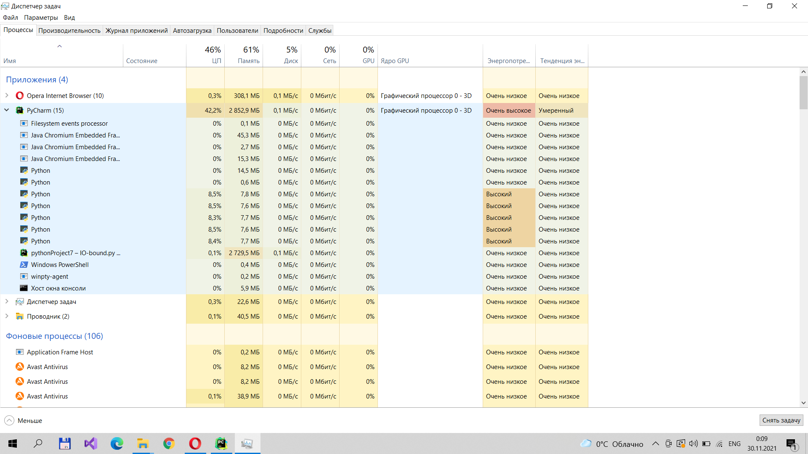
###Время выполнения:

##max_workers=100
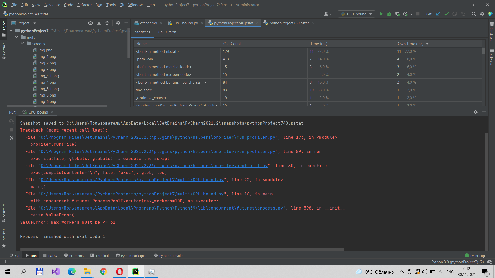
####Можно заметить,что значительно меняется загрузка процессора, время выполнения с увеличением количества max_workers уменьшается. Максимальное количество max_workers - 61 из-за особенностей операционной системы.

