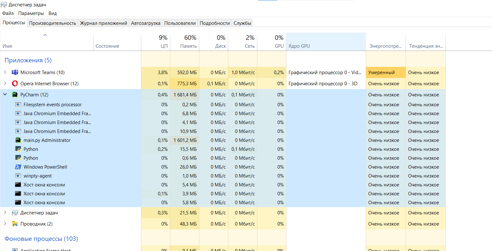
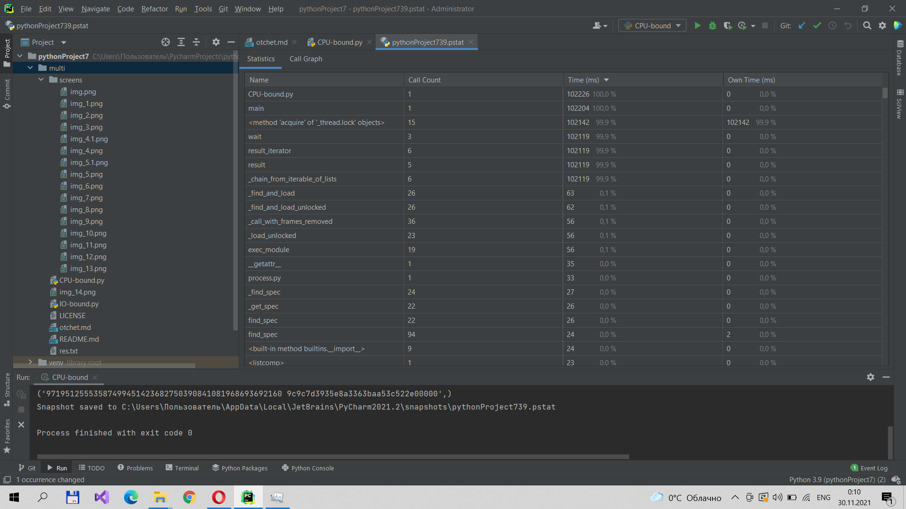

# IO-bound
## Синхронная проверка ссылок:
### Диспетчер задач:

### Время выполнения:

## Выполнение используя ThreadPoolExecutor:
## max_workers = 5
### Диспетчер задач:

### Время выполнения:

## max_workers = 10
### Диспетчер задач:

### Время выполнения:

## max_workers = 100
### Диспетчер задач:

### Время выполнения:

#### Загрузка памяти почти не отличается, загрузка ЦП совсем немного увеличивается. Но время выполнения существенно сокращается.

# CPU-bound
## Замер на поиске 5 монет.
## Выполнение на одном ядре:
### Диспетчер задач:

### Время выполнения:

## max_workers=2
### Диспетчер задач:

### Время выполнения:

## max_workers=4
### Диспетчер задач:

### Время выполнения:

## max_workers=5
### Диспетчер задач:

### Время выполнения:

## max_workers=10
### Диспетчер задач:

### Время выполнения:

## max_workers=100

#### Можно заметить,что значительно меняется загрузка процессора, время выполнения с увеличением количества max_workers уменьшается. Максимальное количество max_workers - 61 из-за особенностей операционной системы.

